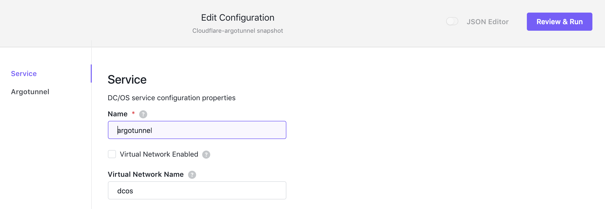
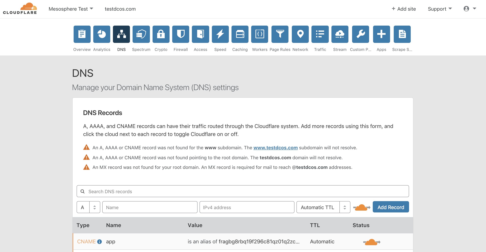
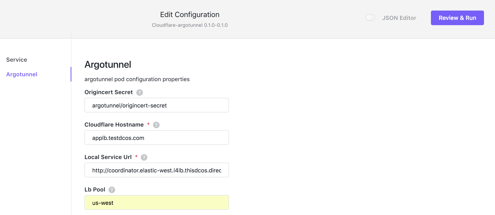
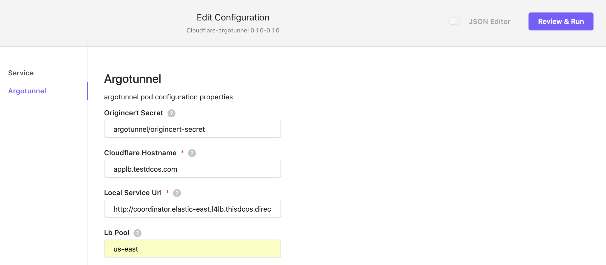
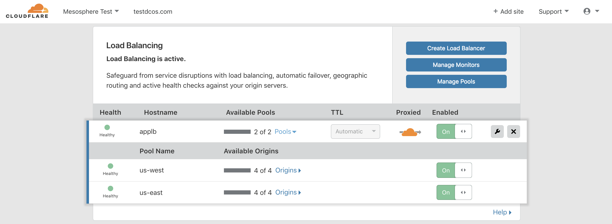

# DC/OS Cloudflare Argo Tunnel Service Guide

**Note: Work in progress this service hasn't been released**

# Overview

[Cloudflare] Argo Tunnel is the fastest way to make services that run on DC/OS private agents, that are only bound to the DC/OS interal network, accessible over the public internet. When you launch the tunnel for your service, it creates persistent outbound connections to the 2 closest Cloudflare PoPs over which the entire Cloudflare network will route through to reach the service associated with the tunnel. There is no need to configure DNS, update a NAT configuration, or modify firewall rules (connections are outbound). The argo tunnel exposed service gets all the QOS offered by the Cloudflare network, e.g. DDoS protection, Crypto, Firewall, WAF, Access, ... .


**Note:** The DC/OS Cloudflare Argo Tunnel Service only works with DC/OS Enterprise since it requires the secret capability.


# Quick Start

## Prereqs

* Cloudflare account
* Argo Tunnel enabled, its a priced feature, details you can find [here](https://www.cloudflare.com/plans/)
* Cloudflare certificate, used by argo tunnel to authenticate to cloudflare edge, here the [steps](https://developers.cloudflare.com/argo-tunnel/quickstart/)


## Install

... create dc/os secret to store the cloudflare certificate ... default name is argotunnel/origincert-secret
```
dcos security secrets create -f ~/.cloudflared/cert.pem argotunnel/origincert-secret
```

... in the following we use elasticsearch as our target service

... to create an instance pick cloudflare-argotunnel from catalog


... there are two configuration sections

... the 1st for the general service aspects


... the following two sections show how you can create a dns record or a load balancer

### DNS confuguration

... configuration for dns record


... a look at the cloudflare console dns section


... trying the service
```
https://app.testdcos.com/_cluster/health?pretty
```

```
{
  "cluster_name" : "elastic",
  "status" : "green",
  "timed_out" : false,
  "number_of_nodes" : 5,
  "number_of_data_nodes" : 1,
  ...
}
```

### LB configuration

... create lb with us-west pool


... a look at the cloudflare console traffic section, dont forget to add a health check for the 1st pool


... next you do same on your east coast dc/os cluster


... a look at the cloudflare console traffic section, dont forget to add a health check for the 2nd pool


... in the lb's settings configure geo steering


... trying the service
```
https://app.testdcos.com/_cluster/health?pretty
```

```
{
  "cluster_name" : "elastic",
  "status" : "green",
  "timed_out" : false,
  "number_of_nodes" : 5,
  "number_of_data_nodes" : 1,
  ...
}
```
